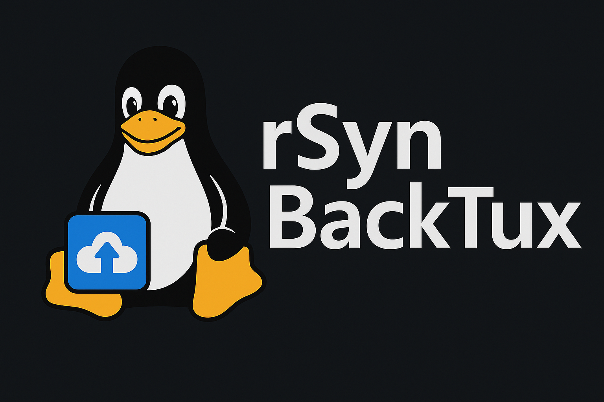

# rSynBackTux – Synology Remote Backup for Linux Servers

<p align="center">
    
</p>


[](https://www.buymeacoffee.com/w0rkingchr1s)

rSynBackTux (**r**sync|**Syn**ology|**Back**up|**Tux**) ermöglicht es, **beliebige Linux-Server automatisiert und zuverlässig auf eine Synology NAS zu sichern** – ohne zusätzliche Software oder Agenten.  
Die Sicherung erfolgt per **rsync-Daemon** auf der Synology und einem automatisch installierten Backup-Script auf den Linux-Servern.

Der Installer richtet alles automatisch ein:

- Passwortdatei (für rsync)  
- Backup-Script unter `/usr/local/sbin/backup-to-synology.sh`  
- Logfile unter `/var/log/backup-to-synology.log`  
- (optional) Cronjob für tägliche Backups  
- Hostname-basierte Ordnerstruktur auf der Synology (`NetBackup/<SERVERNAME>/`)

---

## Repository

GitHub:  
**<https://github.com/W0rkingChr1s/rSynBackTux>**

Direkter Installer (Raw-Datei):  
**<https://raw.githubusercontent.com/W0rkingChr1s/rSynBackTux/main/src/install-syno-backup.sh>**

---

## Features

- Vollständige Serversicherung (Root-Filesystem `/`)
- Automatische Erstellung eines Zielordners je Server
- Passwortlose Automatisierung mittels `/root/.rsync_pass`
- Zuverlässige rsync-Optionen ohne ACL/xattr-Probleme
- Automatische Ausschlüsse für Linux-Pseudo-Dateisysteme
- Ausführliches Logging
- Vollautomatische Installation in wenigen Sekunden
- Sicherung über Standard-Dienste (kein Agent, kein Docker nötig)

---

## Changelog

Siehe [CHANGELOG.md](CHANGELOG.md) für eine Übersicht der Änderungen pro Version.

---

## Funktionsweise

1. Auf der Synology wird ein **rsync-Zielmodul (`NetBackup`)** eingerichtet.
2. Jeder Linux-Server meldet sich per **rsync-Konto `backup`** dort an.
3. Das Backup-Script kopiert das komplette Dateisystem `/` nach `NetBackup/<SERVERNAME>/`.
4. Cron führt den Prozess regelmäßig aus.
5. rsync überträgt nur geänderte Dateien (inkrementell).

---

## Voraussetzungen

### Synology NAS

- DSM 6 oder DSM 7
- Shared Folder für Backups (z. B. `NetBackup`)
- Aktivierte rsync-Dienste:
  - „rsync-Dienst aktivieren“
  - „Netzwerksicherungsziel aktivieren“
- rsync-Konto `backup` mit Berechtigung auf das Modul `NetBackup`

### Linux-Server

- rsync installiert (Installer kümmert sich darum)
- root-Rechte
- Bash

Getestet mit u. a.: Ubuntu, Debian, Rocky, AlmaLinux, RHEL, Fedora, openSUSE, Arch.

---

## Installation

### 1. Installer herunterladen & starten

Mit `curl`:

```bash
curl -s https://raw.githubusercontent.com/W0rkingChr1s/rSynBackTux/main/src/install-syno-backup.sh | sudo bash
```

Mit `wget`:

```bash
wget -qO- https://raw.githubusercontent.com/W0rkingChr1s/rSynBackTux/main/src/install-syno-backup.sh | sudo bash
```

### 2. Der Installer fragt interaktiv

- Synology-Host / IP
- rsync-Modulname (Standard: `NetBackup`)
- rsync-Benutzername (Standard: `backup`)
- Unterordner (Standard: Hostname des Servers)
- Passwort für rsync (wird nicht im Repo gespeichert, nur lokal in `/root/.rsync_pass`)
- Ob ein Cronjob eingerichtet werden soll (inkl. Uhrzeit)

---

## Backup Script

Nach der Installation liegt das Script unter:

```bash
/usr/local/sbin/backup-to-synology.sh
```

### Das Script

- sichert `/` inkl. aller Unterverzeichnisse
- schließt Pseudo-Dateisysteme aus:
  - `/dev`
  - `/proc`
  - `/sys`
  - `/run`
  - `/tmp`
  - `/mnt`
  - `/media`
  - `/lost+found`
- schreibt Log-Einträge nach:

```bash
/var/log/backup-to-synology.log
```

### Manuelles Ausführen

```bash
sudo /usr/local/sbin/backup-to-synology.sh
```

---

## Weitere Server einbinden

Auf jedem neuen Server einfach:

```bash
curl -s https://raw.githubusercontent.com/W0rkingChr1s/rSynBackTux/main/install-syno-backup.sh | sudo bash
```

Der Installer:

- erkennt automatisch den Hostnamen
- erzeugt auf der Synology automatisch:
  - `NetBackup/<SERVERNAME>/`
- richtet Cron ein
- erstellt Passwortdatei & Script

Keine manuelle Konfiguration notwendig.

---

## Ordnerstruktur auf der Synology

Beispiel:

NetBackup/  
├── server1/  
├── server2/  
├── server3/  
└── server4/  

Jeder Server hat seinen eigenen Bereich.

---

## Troubleshooting

### rsync fragt nach Passwort

- Installer nicht als root gestartet
- `/root/.rsync_pass` hat falsche Rechte (`chmod 600`)
- Passwort auf der NAS falsch gesetzt

### `Connection reset by peer`

- falscher Modulname (`NetBackup` vs `netbackup`)
- rsync-Konto `backup` hat keine Berechtigung auf das Modul
- Ziel war fälschlicherweise ein HyperBackup-Modul statt eines rsync-kompatiblen Moduls

### Cronjob läuft nicht

Prüfen mit:

```bash
sudo grep CRON /var/log/syslog
```

oder:

```bash
sudo systemctl status cron
```

### Backup bricht ab

Mögliche Ursachen:

- NAS im Ruhezustand / HDD-Hibernation
- Netzwerkprobleme zwischen Server und NAS

---

## Uninstallation

Script entfernen:

```bash
sudo rm /usr/local/sbin/backup-to-synology.sh
```

Passwortdatei löschen:

```bash
sudo rm /root/.rsync_pass
```

Cronjob löschen:

```bash
sudo crontab -e
```

Ordner auf der Synology löschen (optional):

```bash
NetBackup/<SERVERNAME>/
```

---

## Lizenz

Dieses Projekt steht unter der MIT-Lizenz.  
Nutzung, Anpassung und Weiterentwicklung sind ausdrücklich erwünscht.

---

Made with ❤️, sweat and slightly too much coffee ☕🐧
